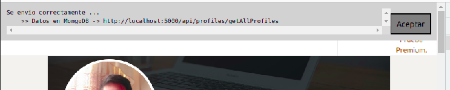

# Bootcamp Krowdy - Reto 1 Scraping Profile GoogleChrome Extension

Levantar servidor backend para el almacenamiento de la data.

https://github.com/galuf/BootcampReto1Api

## Ubicarse en:
https://www.linkedin.com/search/results/people/?keywords=fullstack

## Iniciar la extencion:

 

## Proceso Scraping

## Fin Scraping

## Result API

